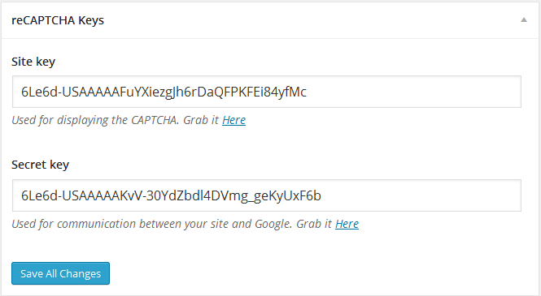
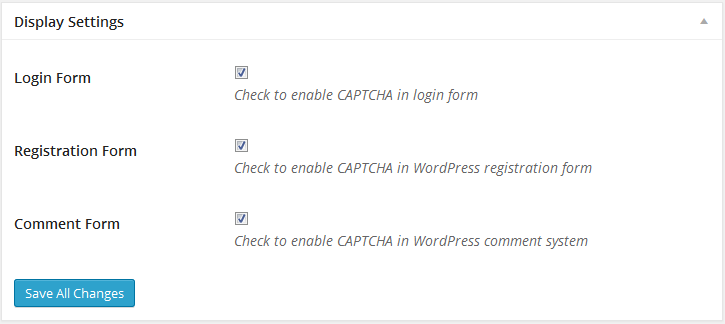
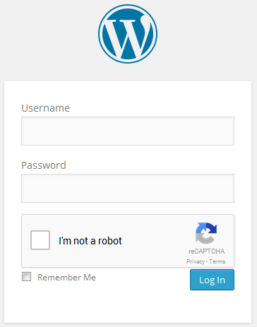

# ব্রুটফোর্স থেকে নিরাপদে থাকা

Brute Force ব্যাপারটি এখন আর আগের মত নেই , আগে একটা ছোট স্ক্রিপ্ট দিয়েই কাজ চালানো যেতো , এখন CMS গুলো ৪-৫ বার ভুল ট্রাই করার পর অটোমেটিক IP ব্লক করে থাকে। কিন্তু তাই বলে থেমে নেই Brute Force কারীরা, তারা প্রক্সি/Soks/VPN/Tor দিয়ে স্ক্রিপ্ট বানিয়ে নিয়েছে , যেগুলো ভুল ট্রাইয়ের পর আইপি চেঞ্জ করে অন্য আইপি থেকে ট্রাই করতে থাকে। এর প্রতিকার হিসাবে নিচের পদ্ধতিটি ব্যবহার করতে পারেন।

**`No CAPTCHA reCAPTCHA`** প্লাগিনটি ইন্সটল করুন এবং এক্টিভেট করুন। এরপর **reCAPTCHA Keys** এ `সাইট কি` ও `সিক্রেট কি` দিয়ে সেভ করুন। `কি` সংগ্রহ করতে **[reCAPTCHA](https://www.google.com/recaptcha/admin )**  সাইটে যেয়ে আপনার সাইট রেজিস্টার করুন এবং কি সংগ্রহ করুন। 

কোথায় কোথায় ক্যাপাচা দেখাবে তা দেখিয়ে দিন।

আপনার লগিন পেজ নিচের মত দেখাবে।

