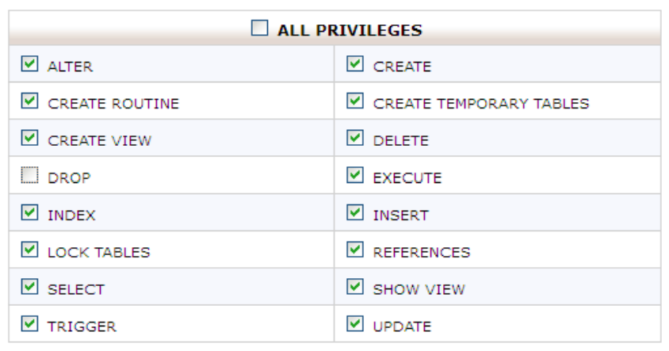

##ইটেলশন সোর্স বানানো
প্রথমে  “wordpress.org”  থেকে ওয়ার্ডপ্রেস এর সর্বশেষ সংস্করণটি ডাউনলোড করুন। ফাইলটি zip আকারে ডাউনলোড হবে। ফাইটি  extract বা unzip করুন। এরপর wordpress ফ্লোল্ডারে ডুকে সব ফাইল সিলেক্ট করে আবার zip করুন।

##ডাটাবেস প্রস্তুত করুন
অনেকেই ওয়ার্ডপ্রেস  ইন্সটল করার সময় অটোমেটিক ইন্সটলার ব্যবহার করেন, এটা পরিহার করতে হবে। ওয়ার্ডপ্রেস ম্যানুয়ালী ইন্সটল করা উত্তম। ম্যনুয়ালী ইন্সটল করতে হলে প্রথমেই আপনাকে একটি ডাটাবেস ও ডাটাবেস ইউজার তৈরি করতে হবে। ডাটাবেস ইউজারকে ডাটাবেস ব্যবহার করার জন্য অনুমতি দিতে হবে। ইউজার যাতে ডাটাবেস ড্রপ করতে না পারে সেই হিসাবে পারমিশান দিতে হবে।

