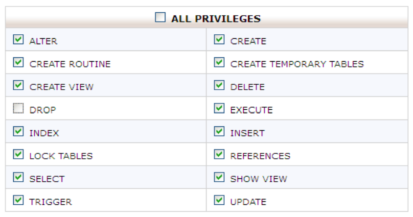
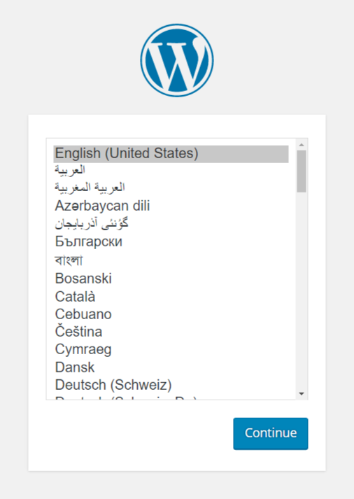
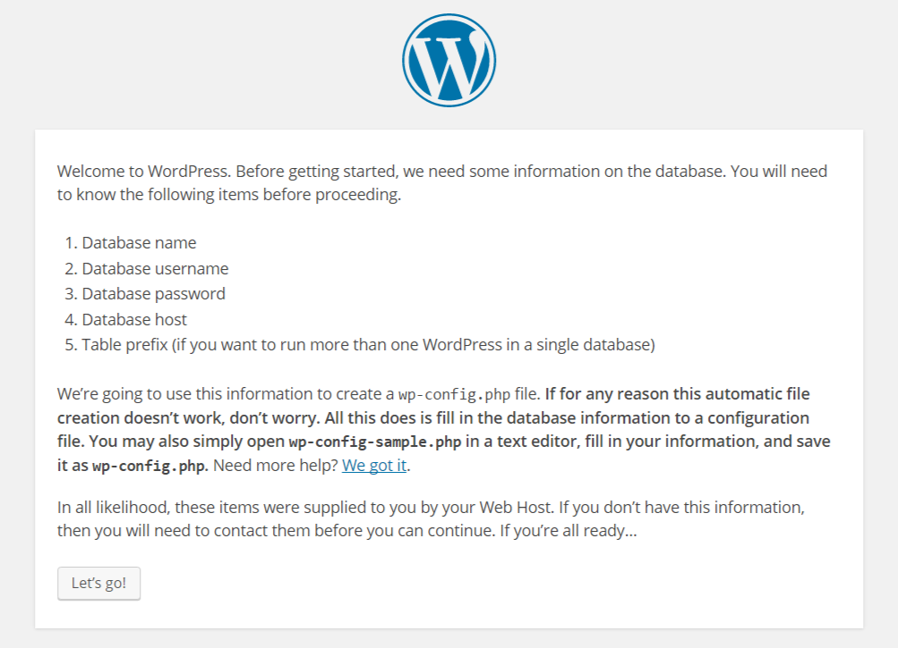
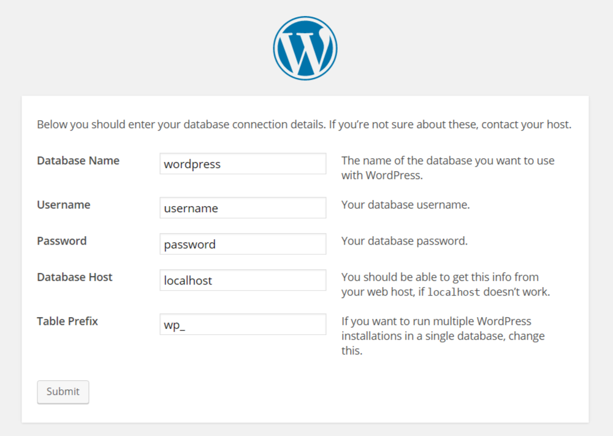
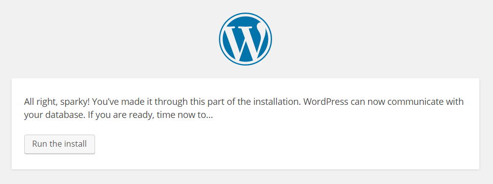
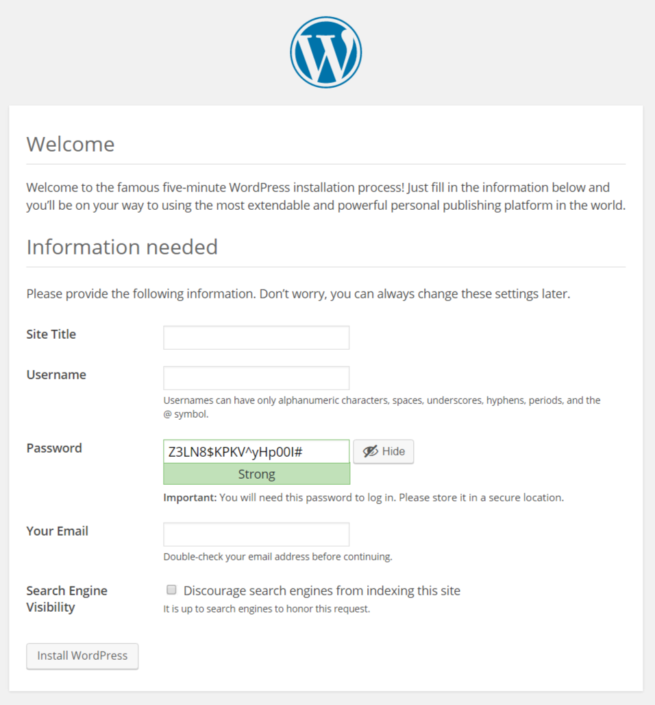

##ইটেলশন সোর্স বানানো
প্রথমে  “wordpress.org”  থেকে ওয়ার্ডপ্রেস এর সর্বশেষ সংস্করণটি ডাউনলোড করুন। ফাইলটি zip আকারে ডাউনলোড হবে। ফাইটি  extract বা unzip করুন। এরপর wordpress ফ্লোল্ডারে ডুকে সব ফাইল সিলেক্ট করে আবার zip করুন।

##ডাটাবেস প্রস্তুত করুন
অনেকেই ওয়ার্ডপ্রেস  ইন্সটল করার সময় অটোমেটিক ইন্সটলার ব্যবহার করেন, এটা পরিহার করতে হবে। ওয়ার্ডপ্রেস ম্যানুয়ালী ইন্সটল করা উত্তম। ম্যনুয়ালী ইন্সটল করতে হলে প্রথমেই আপনাকে একটি ডাটাবেস ও ডাটাবেস ইউজার তৈরি করতে হবে। ডাটাবেস ইউজারকে ডাটাবেস ব্যবহার করার জন্য অনুমতি দিতে হবে। ইউজার যাতে ডাটাবেস ড্রপ করতে না পারে সেই হিসাবে পারমিশান দিতে হবে। 

লক্ষণীয় এই যে, ইউজারকে ডাটাবেসে সবকিছু করার অনুমতি দেওয়া হবে কেবল ডাটা `DROP` করার অনুমতি ব্যাতিত। কারন কেউ আপনার সাইটের ডাটাবেস এক্সেস পেলে সে `DROP DATABASE databse_name` কুয়েরী দিয়ে ডাটাবেস ড্রপ করে দিতে পারে। কোন হ্যাকার বসে বসে একটা একটা করে ডাটা ডিলেট করবে না। এতে আপনার ডাটাবেস অনেকটা সিকিউর থাকবে। চাইলে ডিলেট আনচেক করে দিতে পারেন , তবে এটা করে দিলে নিজের কাজ করতে সমস্যা হবে।

##ইন্সটলেশন
* ১ম ধাপে বানানো zip ফাইলটি সি-প্যানেলের ফাইল ম্যানেজার/ftp/sftp দিয়ে আপলোড করুন , আপলোড হয়ে গেলে zip ফাইলটি unzip করুন।
* এবার ব্রাউজার থেকে আপনার সাইটের URL এ প্রবেশ করুন। ওয়ার্ডপ্রেস এর ইন্সটলার আপনাকে ভাষা নির্বাচন করতে বলবে, নিজের পচ্ছন্দমত ভাষা নির্বাচন করুন।

* এর পরের ধাপে ওয়ার্ডপ্রেস আপনাকে ইন্সটলেশন সম্পর্কে কিছু তথ্য দেখাবে। “Let’s go!” ,বাটনে ক্লিক করে পরের ধাপে এগিয়ে যান। 

* এবার ওয়ার্ডপ্রেস আপনার কাছে ডাটাবেস সম্পর্কিত তথ্য চাইবে। সকল তথ্য দিন , `Table Prefix` এ র‍্যান্ডম ল্যাটার দিয়ে একটি শব্দ লিখুন এবং সর্বশেষে একটি আন্ডারস্কোর যুক্ত করুন (উদাঃ `YxY_` ) এবং Submit বাটনে ক্লিক করুন। অনেকে সাজেসন দিয়ে থাকেন যে সাল্ট জেনারেট করে কনফিগ ফাইলে দিতে। এটার প্রয়োজন হয় না, কারন ওয়ার্ডপ্রেস ইন্সটলের সময় সাল্ট অটোমেটিক জেনারেট হয়।

* এবার `Run the install` এ ক্লিক করুন । এবার সাইটের নাম , এডমিন ইউজার এর ইউজারনেম , পাসওয়ার্ড এবং আপনার ইমেইল দিন। ইউজারনেম `admin`/`root`/`boss` এগুলো ব্যবহার না করাই উত্তম। পাসওয়ার্ড নূন্যতম ৮ অক্ষরের ব্যবহার করুন। আপারকেস, লোয়ারকেস, নিউমারিক ও সিম্বল দিয়ে পাসওয়ার্ড বানানোর চেস্টা করুন। এতে ডিকশেনারি এটাক থেকে সাইট সুরক্ষিত থাকবে।

